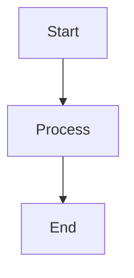
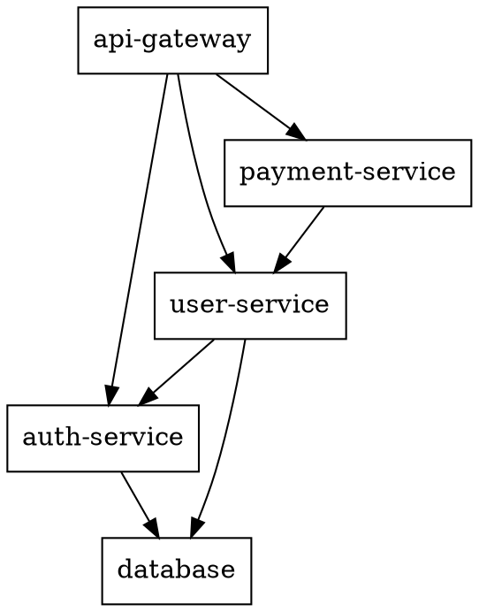
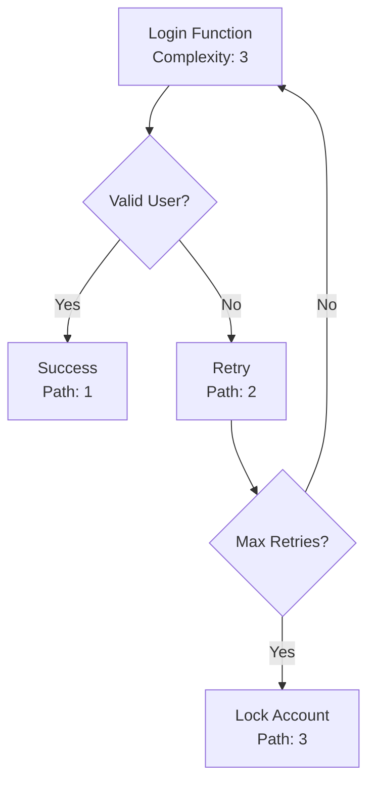
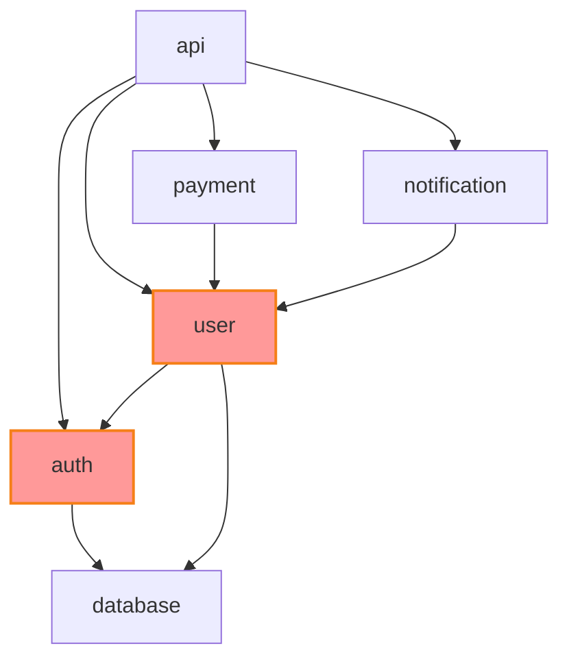

# General diagrams

# Inspired by https://github.com/wcygan/dotfiles

Analyses code and architecture to generate explanatory diagrams.

## Usage

```
/visualise <target>
/visualise <target> --type <flowchart|sequence|erd|architecture>
/visualise <target> --format <mermaid|plantuml|graphviz>
/visualise <target> --output <file.md>
```

**Default Output Location**: `/docs/diagrams/` directory

## Description

This command transforms complex code, logic, and system architectures into clear, visual diagrams. A picture is worth a thousand lines of code - this command makes systems easier to understand, debug, and communicate about.

### What it generates:

#### 1. Code Flow Visualization

Analyzss function and method logic to create flowcharts:

* Function analysis (for example, Python code to Mermaid flowcharts)
* Charm relationships (for example, a relationship diagram showing this charm at the heart and the required and optional requirer/provider integrations that are possible)
* System architecture diagrams (for example as a Mermaid graph)
* API interaction sequences (for example, sequences of Juju events as a Mermaid sequence diagram)

## Output Formats

### Mermaid (Default)

Generates Mermaid.js diagrams that render in GitHub, GitLab, and VS Code:

````markdown
# Function Flow Analysis


````

### Graphviz DOT

Generates DOT files for complex dependency graphs:



## Examples

### Visualize a function:

```
/visualize ./src/charm.py:MyCharm._on_install
```

### Visualise integrations:

```
/visualize charmcraft.yaml --type=erd
```

### Generate system architecture:

```
/visualize . --type architecture
```

### Create API sequence diagram:

```
/visualize ./src/charm.py --type sequence
```

### Output to specific file:

```
/visualize ./src/charm.py --output docs/diagrams/auth-flow.md
```

## Advanced Features

### Interactive Diagrams

Generates interactive diagrams with clickable elements:


### Complexity Analysis

Annotates diagrams with complexity metrics:



### Dependency Analysis

Shows dependency relationships and potential circular dependencies:


